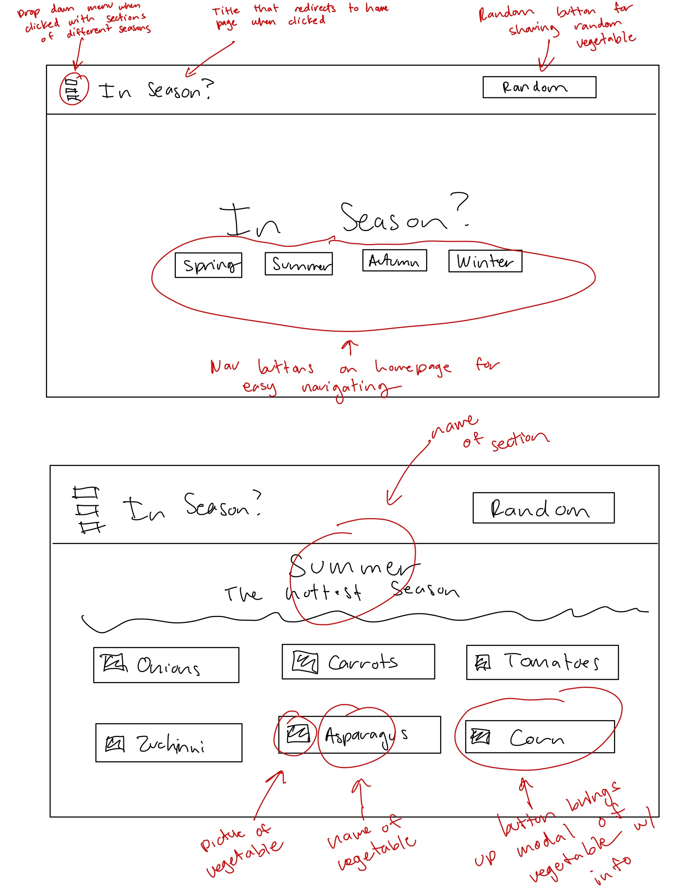
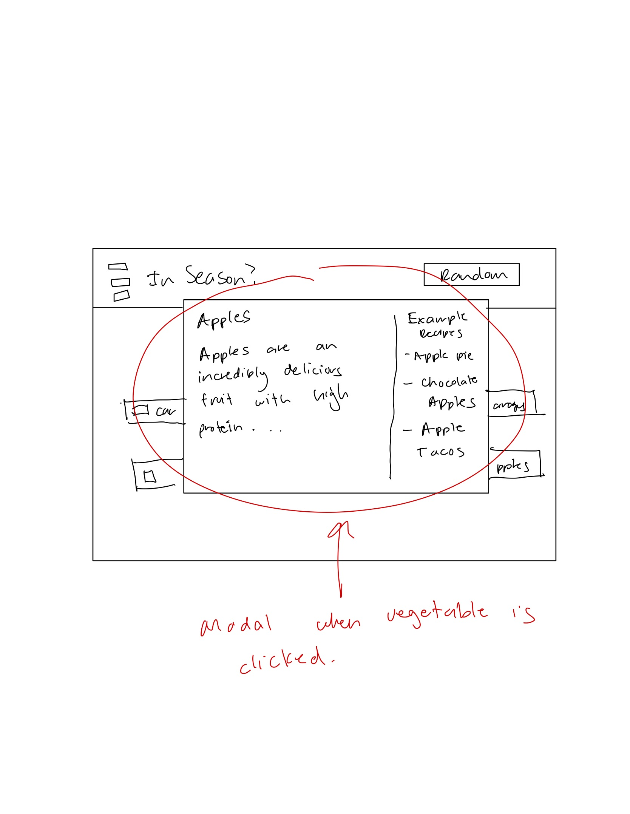

# In Season

In Season is a Javascript Project that is centered around creating an interactive web application using Javascript. In Season will be an interactive website that will allow visitors to see various types of vegetables and which season they are the best in. In Season will also include descriptions and example recipes for visitors of each vegetable. There will be a random button that will allow visitors to view a random vegetable for inspiration. The goal of In Season is to assist intermediate home cooks in their pursuit of cooking mastery by giving them access to indepth information regarding various vegetables. 

## Functionality & MVP's

1. Allow for visitors to see different vegetables that are categorized by seasons. 
2. Have information and descriptions regarding the vegetable that will be helpful in further developing a person's cooking ability. 
3. Have a navigation header that will allow visitors to navigate between each section (each section will be a different season)
4. Include a random functionality that will allow visitors to view a random vegetable for inspiration. 
5. Will be a single page website with different sections for ease of use. 

In addition, this project will include: 
1. Modals for each vegetable with information and example recipes. 
2. A production README. 
3. Love and Care put into its development. 

## Initial Renders

## Technologies, Libraries, API's
1. Vegetable information will be pulled from Fit Life Food API from RAPID Api. 
2. Webpack will be used to transpire and bundle Javacript code.
3. Npm is used to manage In Season dependencies. 
4. FullPage.js will be used to create a single page scrolling website. 
5. Possibly a library for easily creating modals. 

## Implementation Timeline
1. Friday Afternoon & Weekend: Research technologies that will be used for the project. Create the base framework for the entire the project. Figure out how different technologies will work with each other. 
2. Monday: Connect API with website. Find extra information for each of the vegetables. 
3. Tuesday: Make sure core functionality works. Begin adding CSS styling for the website. Work on modals and animation. 
4. Wednesday: Finish CSS styling and animations. Add Bonus features if finished early. 
5. Thursday Morning: Deply to GitHub pages and update README.md. 

## Bonus Features 
1. A cheat day functionality that will allow visitors to add various restaurants and a random restaurant will be chosen for them from those added.
2. Animations for showing random elements getting chosen. 
3. Updated fonts. 
