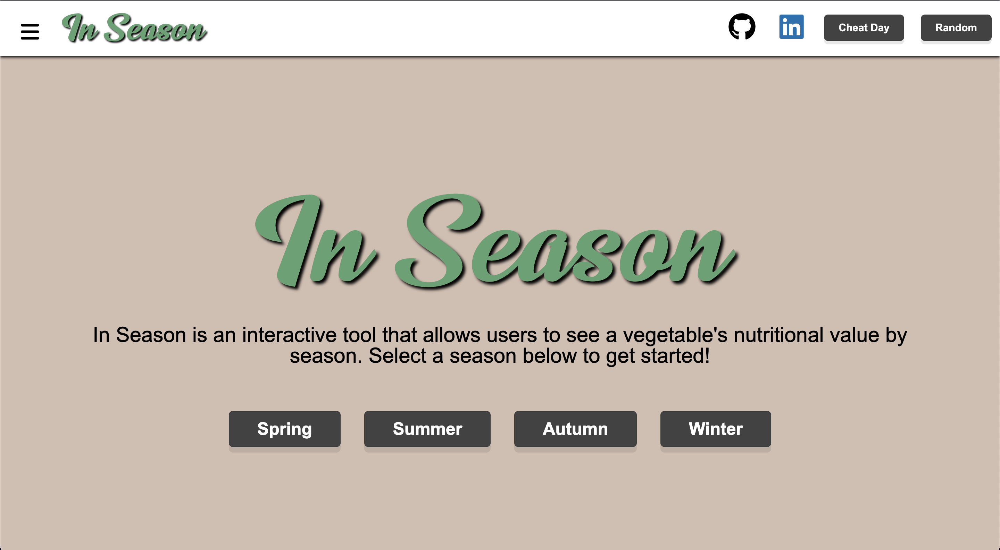

<a href="https://enintoah.github.io/in_season/"><h1>In Season</h1></a>

<a href="https://enintoah.github.io/in_season/">In Season</a> is a web application that is centered around creating an interactive way to learn about vegetables that are currently in season using Javascript. In Season will be an interactive website that will allow visitors to see various types of vegetables and which season they are the best in. There will be a random button that will allow visitors to view a random vegetable for cooking inspiration. The goal of In Season is to assist intermediate home cooks in their pursuit of cooking mastery by giving them access to  information regarding various vegetables. 

## Functionality 

1. Allow for visitors to see different vegetables that are categorized by seasons. 
2. Have information regarding the selected vegetable. 
3. Include many interactive and visually pleasing ways to navigate through seasons and vegetables. 
4. Include a random functionality that will allow visitors to view a random vegetable for inspiration. 
5. Will be a single page website with different sections for ease of use. 
6. Have a modal that pops up with vegetable information.

In addition, this project includes: 
1. A cheat day button that will redirect users to a website to randomly choose a fast food restaurant. 
2. A production README. 
3. Links to personal websites.
4. The current season is auto selected when loading website. 
5. Love and Care put into its development. 

## Possible Additional Future Functionality
1. A drop down menu for additional ways to navigate through the page.
2. Additional information and visuals for each vegetable.
3. Support for different screen resolutions. 

## Technologies Used  
1. Fit Life Food API from RAPID Api to pull vegetable information. 
2. Webpack and Babel is used to transpile and bundle Javacript code.
3. Npm is used to manage In Season dependencies. 
4. Chart.js is used to create interactive charts displaying vegetable information.

